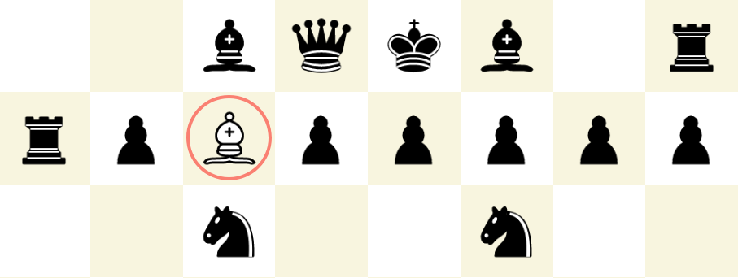

# Chess App ([Play it here](https://mhonert.github.io/chess))

A chess app using React for the UI and Web Workers to calculate AI moves in the background.

## Features
* Play against a computer opponent with 3 difficulty levels
* Move chess pieces using Drag'n'Drop
* Chess engine using minimax algorithm with alpha-beta-pruning
* Responsive board size adjustment

## Planned features
* Save the game (e.g. in local storage)
* Undo a move
* Check for threefold repetition rule
* Support for touch devices (e.g. for Tablets and Smartphones)

## Planned engine improvements
* Performance improvements
  * Use more efficient board representation and move generation algorithms
  * Implement chess engine in [AssemblyScript](https://docs.assemblyscript.org/)
* Improve position evaluation
* Use an opening database and endgame tables
* Mitigate the horizon effect

## Built With
* [React](https://reactjs.org/) - to build the user interface
* [React DnD](https://github.com/react-dnd/react-dnd) - for Drag and Drop support
* [styled-components](https://www.styled-components.com/) - to style React components in JS
* [workerize-loader](https://github.com/developit/workerize-loader) - to move a module into a Web Worker
* [Memoizee](https://github.com/medikoo/memoizee) - to cache intermediate results during move calculation

## License
This project is licensed under the GNU General Public License - see the [LICENSE](LICENSE) for details.

## Attributions
Images for the chess pieces come from [Wikimedia Commons](https://commons.wikimedia.org/wiki/Category:SVG_chess_pieces).
