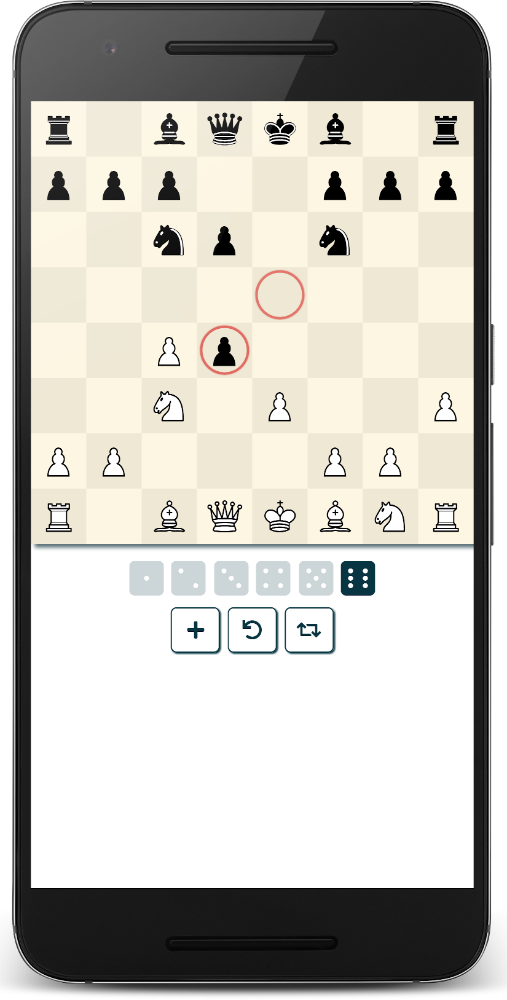

## :sushi: Wasabi Chess Engine

**Wasabi Chess** runs as a Web App in the browser and is also available as a standalone UCI chess engine.

> [**Play here!**](https://mhonert.github.io/chess)

The Web App embeds the engine using [Web Workers](https://developer.mozilla.org/en-US/docs/Web/API/Web_Workers_API)
to compute the AI moves in the background without blocking the main thread for the UI.

### Features

- Chess engine implemented in [AssemblyScript](https://github.com/AssemblyScript/assemblyscript)
- Computer opponent with 6 difficulty levels
- Opening Database for varied gameplay
- Move history to undo player moves
- Drag'n'Drop support to move chess pieces
- Touch support for mobile devices

### UCI Engine

Wasabi Chess can be downloaded from the [Releases](https://github.com/mhonert/chess/releases/latest) page as a standalone UCI Engine.

The engine was tested with **cutechess-cli** and **PyChess** on Linux and **Arena** on Windows, but should also
work with other UCI compatible clients.

> Please note that the UCI engine currently has the following limitations:
> - no support for *pondering* during opponent turns
> - no multi-threading support
> - ongoing searches cannot be cancelled

In order to run the engine outside a Browser environment, a WebAssembly Runtime like for example [WAVM](https://github.com/WAVM/WAVM)
or [Wasmer](https://github.com/wasmerio/wasmer) is required.
The assets on the [Releases](https://github.com/mhonert/chess/releases/latest) page already bundle the very fast **WAVM** runtime.

### Built With
* [AssemblyScript](https://github.com/AssemblyScript/assemblyscript) - for the engine
* [as-pect](https://github.com/jtenner/as-pect) - to test the engine
* [react](https://reactjs.org/) - for the user interface
* [react-dnd](https://github.com/react-dnd/react-dnd) - for Drag and Drop support
* [styled-components](https://www.styled-components.com/) - to style React components in JS
* [react-fontawesome](https://github.com/FortAwesome/react-fontawesome) - to add font icons
* [workerize-loader](https://github.com/developit/workerize-loader) - to load modules as Web Workers

### License
This project is licensed under the GNU General Public License - see the [LICENSE](LICENSE) for details.

### Attributions
* Images for the chess pieces come from [Wikimedia Commons](https://commons.wikimedia.org/wiki/Category:SVG_chess_pieces)
* The opening book was generated from a selection of chess games from the [FICS Games Database](https://www.ficsgames.org)
* A set of 725000 [test positions](https://bitbucket.org/zurichess/tuner/downloads/) collected by the author of Zurichess was used to tune all evaluation parameters 
